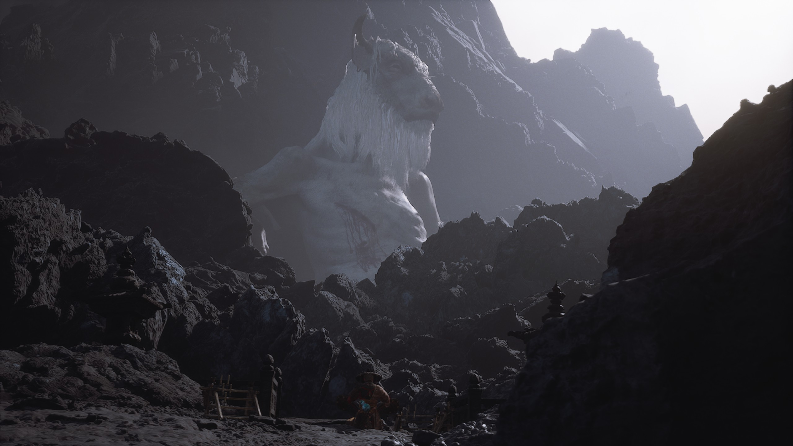
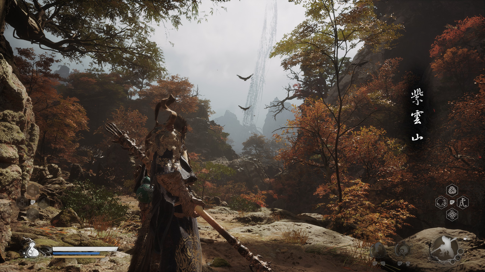
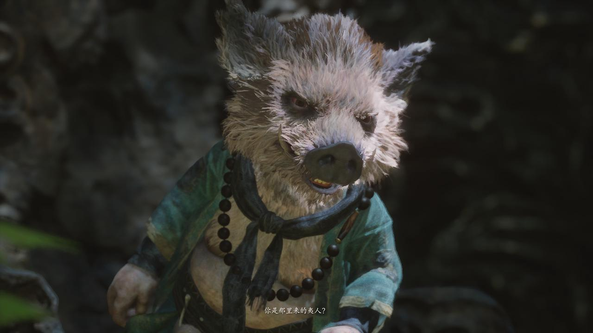

# 《黑神话：悟空》的叙事

《黑神话：悟空》之类的“魂like”游戏（包括《只狼》《空洞骑士》《匹诺曹的谎言》《堕落之主》等等），它们的叙事方式经常被说有一个特点，就是碎片化。
但是“碎片化”这个词不能够完全概括这种魂类叙事的特点。
具体如何碎片化，这样的特色和好处在于什么？
本文就基于调研的资料以及自己的游玩体验，对于魂类叙事做一个研究总结。

## 碎片化叙事的含义

字面意义上讲，就是非线性的传统叙事，不像经典的戏剧般的一二三幕展开，而是这里藏一点，那里藏一点，得玩家去探索，然后才能拼凑出完整的真相。
但是实际上并非字面意义上的碎片化那么简单。游戏和电影戏剧的区别在于，不需要从头到尾前因后果地去讲述故事，而是通过游玩去体验，让玩家来主动了解故事。碎片化更像是一种删繁就简的方式，通过简单的场景和游戏演出设计，就可以对世界观和故事背景一目了然。
——而这就对应了碎片化叙事的第一个好处

## 碎片化叙事的好处

1. 营造沉浸感和真实感

如果游戏中有一个旁白讲故事，那么这个故事就像是别人的故事，玩家不一定听得进去说教，但是如果是一个自己亲身去体验的故事，那么就会感受更深，对于故事更感同身受。

2. 符合“逐渐揭示原则”，激发玩家游玩的兴趣和动力

这些碎片叙事的剧情道具，以及逐渐揭开的真相，都可以作为对玩家的奖励，比如为了最后看天命人睁开眼，或者为了听一遍云宫迅音，所以玩家会去挑战最难打的杨戬。

3. 促进游戏社区生长

碎片化叙事这种谜语人式的叙事方式，导致没有一个完全标准的答案，“一千个人心中有一千个哈姆雷特”，所以可以激发玩家社区的讨论，进而产生更多的二创，让游戏不再局限于游戏本身，为游戏增添生命力和影响力，强化玩家粘性，而且这根本不需要开发商的任何投入！！

其他还有更多的特色，在下文结合具体的案例来补充介绍。

## 具体的碎片化叙事方式

- 场景叙事

玩家玩游戏首先感受到的是地图场景，通过场景表达的内容则是最容易让玩家接受和直接感受的。
比如《黑神话：悟空》中，在苦海北岸，看到一地的骨头，就知道蛇将当时遭遇了什么；在小西天整张地图都可以看到冰天雪地中有僧人在跪拜，这就对应了后面神影图说的黄眉叫他们去苦修；
在火焰山的最后一张地图，可以看到一个巨大的受伤的牛魔王，玩家一瞬间就能够感受到他的虚弱无力，对于火焰山的乱象也找到了原因。

在紫云山，一进地图就可以看到远处从天上掉下来的线，埋下伏笔，引人入胜——也指明了我们的主线目标。

- 战斗叙事

战斗也是玩家必经之路上的一部分。包括boss战以及NPC助战也都可以叙事。

毒敌大王助战帮打晦月魔君，说明他们之前确实有仇，毒敌大王挡不住晦月魔君那一声吼，也符合昴日星君克制蝎子精的设定。
石敢当和石先锋的战斗，可以帮助玩家理解说当时石敢当是被联合封印的，所以石先锋一个人打不过。
在各个boss战开头和boss的对话也有碎片叙事的意味：黄风大王的语音信息量不少，“我逃不掉，你，也逃不掉”“我已无救，何必回头”；“还敢回来，何苦回来”说明已经不是第一次和天命人战斗。

在《艾尔登法环》中，米莉森是四姐妹中唯一一个会用流水剑法的，说明他和玛莲妮娅的关系最近；梅琳娜助战用的黑刀的动作，暗示其稀人血统。

- NPC与任务

在做主线和支线任务的时候，会遇到许多的NPC角色并和他们对话——就像是一部公路片一样，在旅行的路上，遇到不同的人，了解他们的故事，甚至激发玩家的同情，让玩家知道自己并非孤单，有许许多多的人和自己一样处于这个世界中。

魂类游戏中有不少精彩的人物塑造，《黑神话》中的四妹，二师兄，贯穿《黑暗之魂1&3》甚至到《艾尔登法环》的帕奇，《黑暗之魂2》的鲁卡提耶，《艾尔登法环》的众生。正是这一个个NPC的悲欢离合和命运浮沉，才能够拼凑出完整的宏大诗篇。

- 其他

有一些动画播片，也算是玩家游玩的必经之路，往往会讲述一部分直观的故事。比如《黑暗之魂》开头的动画，讲述了黑暗之魂的分授，最为基础的世界观的铺垫；《黑神话》开头的动画讲述了大圣六根的传说，指明了主线任务；以及每一章打完后的动画，其本身就已经可以作为莫大的奖品，更还可以承担补充叙事和总结的工作。

和动画配合的，歌曲也可以加强叙事。《未竟》这首歌，在玩家打完第六章之后，更加强化了孙悟空的悲情英雄色彩——“英雄被写成诗，只剩爱与勇敢。诗凝成画，不容悲欢”。旁人只看到了孙悟空英雄的一面，却往往忽略了他的悲欢情欲，更有人性的一面。他虽有金刚不坏之身，但是也会怕疼，不怕火烧但是会怕烟，被师傅误解也会伤心，也有妖怪女朋友。

其他有很多更加细节的碎片，可能玩家不一定会专门去看。这些细节的描述可能是前面直观的表面剧情的补充，也可能是另一侧的描述，揭开故事的真相和谎言的关键。

比如一些装备和道具文本，以及一些图腾形状，角色的服装设计细节：根据四妹的盘发，有人挖掘出四妹和天命人前世的姻缘。

在《黑神话：悟空》中还有神影图这样的图鉴，从袁守诚的角度来讲述各个角色的背景故事，所以玩家可以了解到游玩过程中看不见的另一面：比如普贤菩萨和黄风大王的纠葛，让玩家去思考到底真相是什么；比如补充了黄眉和金蝉子的论道，更丰富了彼此的形象。

## 西游叙事

西游叙事还有一些独特的地方，在于有原文，原著。
除了原著之外，西游记还有86版，动画版，各个全是经典。
所以在游戏中会有不少引用原著，以及致敬的地方。

<figure>

<figcaption  style="font-size:14px;color:#8c8c8c;text-decoration:underline">

游戏中有不少致敬《大话西游》的地方

</figcaption>
</figure>

<figure>

<figcaption  style="font-size:14px;color:#8c8c8c;text-decoration:underline">

八戒在花果山，想起了当时打完白骨精之后自己回花果山找大师兄的场景

</figcaption>
</figure>

这些经典印刻在中国人的骨子里，所以西游传达出的精神内核就可以和中国的玩家共鸣，而对于没有经历过这种文化熏陶的外国人来说，有很多梗是get不到的。
所以后面在《哪吒2之魔童闹海》里面，其所展现的精神内涵和《黑神话》是如此不谋而合。

## 参考文献
- [【黑神话】广智的赤潮燃烧着黑神话的最大秘密！](https://www.bilibili.com/video/BV1xrHteNEgF/?spm_id_from=333.1387.upload.video_card.click)

- [太上老君搞人体实验！黑神话究极隐藏剧情讲了什么？_黑神话悟空_剧情](https://www.bilibili.com/video/BV11S42197wG/?spm_id_from=333.337.search-card.all.click)

- [大圣残躯的名字叫至尊宝：黑神话悟空](https://www.bilibili.com/video/BV1MEtieyEQt)

- [黑猴致敬了大话西游](https://www.bilibili.com/video/BV1rLcweeEnm)

- [碎片化叙事的底层逻辑是什么？不是每个谜语人都能讲魂系叙事_哔哩哔哩bilibili_血源诅咒_杂谈](https://www.bilibili.com/video/BV1NgzsYDEoU/?spm_id_from=333.1387.search.video_card.click)

- 刘璐. 《黑神话·悟空》中的跨媒介叙事研究[J]. 新闻传播科学, 2025, 13(1): 53-58. https://doi.org/10.12677/jc.2025.131008

