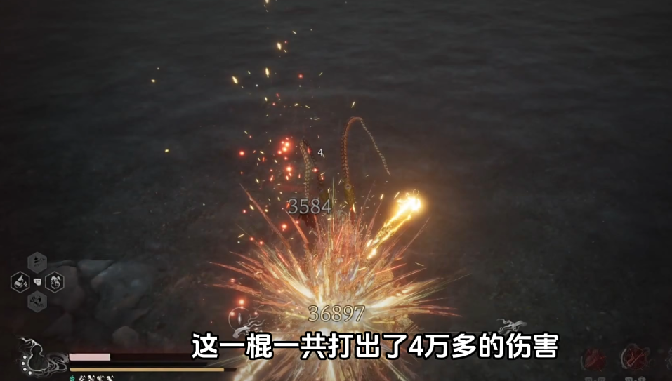

# 从《黑神话：悟空》出发，对于游戏打击感的研究

本文在查阅资料的基础上，结合自己的游戏经历，针对《黑神话：悟空》游戏体验过程中感受较深的打击感问题进行了发散思考和研究。

## 什么是“打击感”？
打击感的定义是什么？当我们谈论“打击感”的时候，我们在谈论什么？

“打击感”的字面意思是打击的感觉，或者俗称的“手感”。
对应英文中的专业名词，"hit feedback" 或 "haptic response"<a href="#ref4">4</a>，
也就是指在游戏之中，进行动作时的操作反馈给玩家带来的直观感受<a href="#ref3">3</a>。

这种操作反馈可以通过多种途径传递给玩家，包括通过视觉，听觉，甚至触觉的方式。

### 视觉反馈
#### 1. 动画特效
视觉反馈主要包括游戏的技能动画等视觉特效。

比如《黑神话：悟空》中用避火罩之后有一圈水纹环绕自身，百眼魔君二阶段的场景变化，比如《只狼》打铁的火花飞溅的粒子效果，等等等等。

除了动画特效之外，还有一些特殊的方式可以加强视觉反馈效果。

#### 2. 镜头的变化和控制

通过运镜来营造电影感，沉浸感，动作感，增强表现力。

比如《黑神话：悟空》中打完亢金星君之后追赶骑龙的一段演出。
<!--  -->
<figure>

<figcaption  style="font-size:14px;color:#8c8c8c;text-decoration:underline">

追赶亢金龙的镜头

</figcaption>
</figure>

《破碎维度》中暗影蜘蛛侠制服敌人，以及被敌人发现时候的镜头。
<figure>

<figcaption  style="font-size:14px;color:#8c8c8c;text-decoration:underline">

暗影蜘蛛侠制服敌人的镜头

</figcaption>
</figure>
<figure>

<figcaption  style="font-size:14px;color:#8c8c8c;text-decoration:underline">

暗影蜘蛛侠被敌人发现的镜头

</figcaption>
</figure>

FPS游戏中被打到头之后镜头和准心会晃动。在《三角洲行动》的战场模式的“攀升”地图中，塔尖平台被导弹击中倒塌的时候会有剧烈的镜头震动，就仿佛真的在眼前倒塌一样。
<figure>

<figcaption  style="font-size:14px;color:#8c8c8c;text-decoration:underline">

导弹轰炸，尖塔倒塌的镜头震动

</figcaption>
</figure>

#### 3. 子弹时间

临时将时间减慢，让玩家可以清晰地看清楚动作和技能的轨迹。

在《黑神话：悟空》中打寅虎那场演出中，躲避之后的子弹时间，可以清晰的感觉到刀剑从身旁擦过，让人肾上腺素飙升。
<figure>

<figcaption  style="font-size:14px;color:#8c8c8c;text-decoration:underline">

寅虎战斗中的子弹时间

</figcaption>
</figure>

此外在《街霸6》这款格斗游戏中，打康和确反康之后时间会减慢（加帧），提供更多的反应和出招思考时间，精防之后也会有明显的子弹时间。
<figure>

<figcaption  style="font-size:14px;color:#8c8c8c;text-decoration:underline">

精防后的子弹时间

</figcaption>
</figure>

《蜘蛛侠：破碎维度》中，2099蜘蛛侠还有专门的技能可以开启子弹时间，帮助玩家从快速的战斗和闪避中缓和。当一波敌人消灭完了之后也会有一个类似结算画面的子弹时间特写。

<figure>

<figcaption  style="font-size:14px;color:#8c8c8c;text-decoration:underline">

《破碎维度》的子弹时间

</figcaption>
</figure>

《虐杀原形》A哥释放万千触须的时候有子弹时间，同时也有镜头的运动，可以看清楚技能对周围造成的伤害。
<figure>

<figcaption  style="font-size:14px;color:#8c8c8c;text-decoration:underline">

《虐杀原形》中的子弹时间

</figcaption>
</figure>

#### 4. 屏幕动效

《黑神话：悟空》中残血的话屏幕周围会闪红变暗，类似于后处理的Vignette的效果。
<figure>

<figcaption  style="font-size:14px;color:#8c8c8c;text-decoration:underline">

黑神话悟空屏幕动效

</figcaption>
</figure>

在《英雄联盟》中，英雄被硬控后屏幕周围会闪白，受伤会闪红也是同理。
<figure>

<figcaption  style="font-size:14px;color:#8c8c8c;text-decoration:underline">

《英雄联盟》设置中可以开启屏幕闪烁

</figcaption>
</figure>

### 听觉反馈

听觉反馈也是打击感的很重要的一个维度。包括游戏音效，音乐，甚至角色的语音。

游戏音效具体来讲还包括技能音效，打击音效，受击的呻吟等等。比如FPS类型游戏中的不同类型的枪声，脚步声。后文还将进一步讨论。

游戏背景音乐经常用于烘托气氛，比如boss进入二阶段之后音乐发生变化，变得激昂或者悲壮；在《Undertale》中对战sans时候的经典审判曲《狂妄之人》衬托了紧张的战斗氛围；又比如进入新场景之后音乐变得空灵，和唯美的画面相互衬托。
<figure>

<figcaption  style="font-size:14px;color:#8c8c8c;text-decoration:underline">

BV1hY9nYJEAS《光与影：33号远征军》demo

</figcaption>
</figure>

此外，音乐也可以作为听觉反馈的提示要素：比如《三角洲行动》中如果附近有boss的话，其专属bgm会响起来。

音乐甚至还可以作为叙事工具：三个音符让老不死人流泪，《黑暗之魂1》中对战乌薪王葛温时的钢琴曲全是白键，明示了其太阳一般光明的一生。

角色语音作为打击感反馈的例子，主要是指战斗过程中角色的出招语音：比如《黑神话：悟空》中虎先锋在出招的时候会喊一声“破”；《英雄联盟》中波比在打被动的时候会喊“左手”，Q会说“要砸下来了”，大招把人锤回去的时候会说“别回来了”；《三角洲行动》中，跑累了之后角色会喘粗气，被打了还会骂脏话之类的，各个点的攻防情况也会有无线电语音提示。这种语音也可以进一步丰富游戏角色的形象，营造游戏的沉浸感。
<figure>

<figcaption  style="font-size:14px;color:#8c8c8c;text-decoration:underline">

虎先锋出招喊“破”

</figcaption>
</figure>

大多数游戏中的听觉反馈是作为陪衬和点缀，但是也有些游戏将其重要性进一步拔高，以音乐音效为核心要素的：《Muse Dash》之类的音游先不谈，还有《Hifi rush》《BPM: BULLETS PER MINUTE》之类的ARPG甚至FPS类型游戏把音乐音效融入到核心玩法，进一步说明了听觉反馈对于“打击感”的重要性。

### 触觉反馈

又叫做力反馈（Force Feedback）<a href="#ref4">4</a>，主要是通过手柄的震动向玩家传递力量感受。比如《黑神话：悟空》中戳棍蓄力的时候会手柄震动，劈棍消耗棍势的时候也会震动，等等等等。

### 受击反馈&打击反馈

前面介绍了一些广义的通用的“打击感”的例子，不过对于动作游戏来讲，还有一些独特的重点，最主要的就是受击反馈和打击反馈。

受击反馈和打击反馈就如同字面意思：玩家受到攻击，出硬直了，需要有反馈告诉玩家被打中了；玩家的攻击打到敌人身上，也需要有反馈告诉玩家打中了敌人。
在实际的游戏中，受击和打击还分为许多不同的情况：被打可能是被打中出硬直，可能是格挡防住，也可能是打康、打确反康、精防；打击同理，有可能是打到盾上，打到肉上，打到弱点，打到墙上弹刀，或者没打中挥空了——这些不同的情况都需要有各自的受击/打击反馈。

结合上文讲的三个维度的铺垫，这一节的内容就更容易解释了。

- 视觉方面，主要包括受击/攻击动作的改变，以及动画特效等。

比如《蜘蛛侠：破碎维度》中角色被打中后会有一个偏头的动作，遇到剧烈的冲击攻击的话会被打飞（受击位移）。
<figure>

<figcaption  style="font-size:14px;color:#8c8c8c;text-decoration:underline">

受击动作

</figcaption>
</figure>
<figure>

<figcaption  style="font-size:14px;color:#8c8c8c;text-decoration:underline">

受击位移

</figcaption>
</figure>

《黑暗之魂》打中敌人之后会飞溅血液，敌人的动作也会变成对应的受击动作。
《黑神话：悟空》中完美闪避之后会留下残影的特效，识破的时候棍子会变红。
《街霸6》的不同类型轻重的拳脚有不同的动作，被打倒在地之后原地起身和后退起身也会有对应的动作变化。蓝防会有蓝光环绕周围，绿冲和迸放也有对应的特效。

- 听觉方面，包括技能音效，不同材质的打击音效，受击呻吟等

《黑神话：悟空》中完美闪避以及识破的时候都会有独特的音效提示，消耗棍势的时候会响一声。《街霸6》的迸放也有独特的声音，所以会有专门的听声音的反迸练习。

一些格挡弹反相关的音效，比如《只狼》的弹刀，《黑神话：悟空》的铜头格挡，《黑暗之魂》《艾尔登法环》中的盾反，《街霸6》的精防，《空洞骑士》打到骨钉上，它们的声音大都是清脆的，清晰的。而打到盾上和打到石头上的声音是低沉的。
《三角洲行动》里面导弹打到载具之后也会反馈回来金属的声音，告诉玩家确实打中了。

场景破坏音效，打破罐子的时候会发出瓷器碎掉的声音。
使用不同武器的打击声音也不同，棍类武器的声音就是木头的声音，用枪类武器的声音就是金属的声音。

​<audio id="audio" controls="" preload="none">
    <source id="mp3" src="./枪声.mp3">
</audio>

两刃三尖枪的打击音效

受击呻吟，包括死亡，坠落受伤时候的惨叫。一个很好的例子就是《匹诺曹的谎言》，在后期主角逐渐变成人之后，在翻滚和受击的时候都会有喘息，而一开始作为人偶则是没有的。

## 什么叫做“打击感好”？

什么叫做一个好的打击感，也就是打击感的目标（作用）和评价标准是什么？

- “打击感”的目标：
让游戏反馈机制达到玩家的潜意识预期，反馈表现足以引起玩家兴趣<a href="#ref3">3</a>，最终都是为了让游戏变得好玩。

根据这个目标，可以进一步提出评价标准

- “打击感”的评价标准：
一般的评价标准是合理+爽快<a href="#ref3">3</a>。

前者是指打击感很真实，“游戏反馈机制达到玩家的潜意识预期”，符合直观的认知，不会觉得别扭；后者就是打击感让玩家觉得舒爽、畅快。两者一起给玩家正向反馈，让游戏变得好玩，所以是一个“好的打击感”。

但是在这些直接的体验之外，我觉得还有一个很重要的，或者说更基础的要素——辨识度。

### 辨识度

在游戏特效中有一个“判定标识”的概念<a href="#ref3">3</a>：合理的打击，表现为一方接触到打击方就会出现命中/防御/特定受创的标志，但现实中或多或少都会出现动画和实际判定略微偏差的效果。判定标识有助于玩家确认判定、减轻上述差异带来的不和谐感。也就是清晰的辨识度有助于带来真实感和爽感。

举一个经典的“手感好”的例子：《英雄联盟》中寒冰射手艾希的源计划皮肤。这个皮肤是公认的艾希手感最好的皮肤，职业选手都喜欢用，而它手感好的原因，很大程度来自于它清晰的辨识度。

在介绍源计划皮肤之前，先补充解释一下，艾希原皮的手感其实是很差的，这主要是两个原因造成的：

**第一点**，艾希原皮的平A的反馈不够明显。

1. 视觉上，抬手动作，攻击动作，收手动作都不够明显，要是不盯着看的话很难感觉得到。和其他英雄对比，比如女警的攻击反馈就是会有子弹弹壳弹出来，以及后坐力的动作；大嘴的攻击弹道很明显，一坨绿色的粘液飞出去；金克丝的机关枪弹道是鲜明的亮色。而艾希的箭太细，颜色太浅，辨识度太低。
<figure>

</figure>
<figure>

</figure>

2. 听觉上，艾希的攻击声音也太轻了，其他英雄比如金克丝的机关枪的声音就更响更清晰，而且攻击音效的持续时间也更长，给玩家更多反应和判断的时间。
<figure>

<figcaption  style="font-size:14px;color:#8c8c8c;text-decoration:underline">

左为艾希的平A声音，右为金克丝的，可以清晰地看出来金克丝的平A音效反馈占了一个完整的四分之一小节的时长

</figcaption>
</figure>

**第二点**，艾希本身的攻击前摇时长和其他传统ad相比，要长很多<a href="#ref2">2</a>。

玩家固然是喜欢短攻击前摇的（挖掘机改了攻击前摇直接跻身T0），因为下了攻击指令之后马上就无延迟地，不能取消地打出去，这是符合人的认知的。

但是攻击前摇长本身并不是问题。一个例子是和赛娜对比，她的攻击前摇比艾希还要更长，但是她的攻击会有一个明显的抬手举枪动作，然后牵引黑雾到敌人身上，枪口发光，最后清脆的响声，带着枪的后坐力，告知玩家这次攻击完成了。这种明显的差异化设计，可以让玩家清晰地认识到，赛娜这个英雄和我玩的其他传统ad不一样，得换一种攻击节奏来适应。
<figure>

</figure>

而艾希的问题则在于，她的攻击反馈看起来和听起来，都和其他ad并无区别，但是实际的数值确有差距，这种差异会不符合其他ad玩家的肌肉记忆，这样就造成了一种别扭和不适应的感觉。

——以上两点造成的结果就是，艾希在低攻速的情况下走A的时候，由于看不清是否平A出手了，所以根据肌肉记忆，经常会过早取消平A，导致卡平A，不够顺畅，进而影响操作手感，影响了爽快感，让玩家感到沮丧，带来了负反馈，觉得艾希这个英雄很难玩。

> 当然影响手感的因素不止这两个，还和攻速有关。比如前摇和艾希相近的其他英雄，EZ被动加攻速，而且主要靠Q输出，用平A对拼的时候不那么严格需求走A；老鼠的Q也会加攻速，开大之后也有明显的攻击反馈。

上面提到的艾希原皮的各方面的辨识度不够的问题，在源计划皮肤中得到了充分的优化和改善：
箭变粗了，高亮了，看得清楚弹道了。攻击姿势有一个明显的摆开架势的过程，而不是原皮那样站立不动。收手动作会有一个比较大幅度的手向后甩的动作，而且攻击完成之后弓还会发光闪一下。
<figure>

<figcaption  style="font-size:14px;color:#8c8c8c;text-decoration:underline">

源计划艾希平A

</figcaption>
</figure>

音效也发生了变化，持续的时间更长一点。
<figure>

<figcaption  style="font-size:14px;color:#8c8c8c;text-decoration:underline">

各AD英雄平A音效对比

</figcaption>
</figure>

通过艾希的这个例子充分说明，辨识度低容易导致不适应，影响爽快感；而清晰的辨识度会更符合玩家的直观感受，并带来畅快的手感。辨识度是真实和爽的前提，首先要足够清晰地辨别出来，才能够达到爽和真实。

辨识度服务于真实感和爽感的例子有很多。

一个例子是伤害数字。红色的字体带来冲击感，一眼知道是克制关系/致命攻击/暴击；而灰色的字体的冲击感就弱一点，表示微弱/普通攻击，符合玩家的直观认知，这是辨识度服务于真实感。
<figure>

<figcaption  style="font-size:14px;color:#8c8c8c;text-decoration:underline">

BV14yHaeUEHK

</figcaption>
</figure>

又比如《只狼》的弹刀打铁，带有高辨识度的清脆的声音和明显的火花特效；
打寅虎很爽，因为动作大开大合，加上子弹时间和镜头语言，清晰地告诉我们闪避过去了；
《破碎维度》中2099蜘蛛侠开启子弹时间之后画面会的对比度会降低，声音也会变扭曲，终极蜘蛛侠爆气之后画面会变红，对应愤怒的状态。
——这些都是先有了足够的辨识度，然后玩家才能感觉到爽感和真实。 

另一方面，作为反面教材，我在游玩《黑神话：悟空》的时候，有明显的感觉到辨识度不好的地方。

受击反馈不明显。和《破碎维度》比起来，《黑神话：悟空》动作更复杂，所以容易导致受击动作和其他动作区分不开，辨识度不够明显。所以容易牺牲战斗的爽快感。
尤其是对战海上僧，这个普遍认为的粪怪。零帧起手，打击动作和音效都太软，反馈不明显。很多时候我都不知道自己被打中了，不知道自己进硬直，也不知道什么时候能够行动，玩起来尤其别扭。
<figure>

<figcaption  style="font-size:14px;color:#8c8c8c;text-decoration:underline">

BV18aWMe4EWD

</figcaption>
</figure>

倒地的硬直问题，在《蜘蛛侠：破碎维度》中有一个很优秀的例子，角色倒地起身的时候会有一个转腿打击周围的受身动作，这就是一个很好的辨识标志，表示自己可以行动了，但是《黑神话：悟空》则没有这种标志。
<figure>

<figcaption  style="font-size:14px;color:#8c8c8c;text-decoration:underline">

《破碎维度》地面恢复

</figcaption>
</figure>

——诚然这两款游戏的美术风格不一样，《破碎维度》更偏卡通漫画科幻风格，《黑神话》更写实。但是和《匹诺曹的谎言》对比，同样是写实风，也都是色调偏暗的，《匹诺曹的谎言》可以通过敌人变红来增加提示的辨识度，表示敌人的下一次攻击只能完美格挡。
<figure>

<figcaption  style="font-size:14px;color:#8c8c8c;text-decoration:underline">

敌人变红表示下次攻击只能完美格挡

</figcaption>
</figure>

### 真实感 & 爽感

对于打击感的进一步评价，有拟真感、临场感、观察感、夸张感四象限，前两者对应真实感，后两者对应爽感<a href="#ref3">3</a>。
对于写实类的游戏则更加强调拟真感和临场感，此时夸张感、观察感与之相抵触，但是也可以加入一些卡通的夸张要素，比如上文提到的《匹诺曹的谎言》中敌人变红。

再对于真实感和爽感两方面分别来说：

- 真实感

游戏中有一个命中检测（Hit Detection）的概念，是指游戏中对玩家的攻击是否命中了目标的判断机制。一个好的命中检测系统能够提供精确的打击反馈，让玩家感觉到他们的攻击是真实有效的。为了追求真实感，打击反馈要足够准确，才能符合玩家的认知。

前文在讲打击/受击反馈时已经提到了很多例子，不同的材质有不同的响应，打到盾上的声音就是沉闷的响声，打到墙上弹刀会有清脆的声音，等等等等。

- 爽感

爽感则更加是一种抽象和主观的体验，其含义也更加复杂。大体来讲，我认为爽感实际上是一种比真实感更强烈的正反馈。

举例来说，《破碎维度》的四种不同玩法，都有各自的爽点。
动作系统的一些高级技能，蓄力攻击等多样的动作模组的特效，2099蜘蛛侠的蓄力快速攻击一斩千击——一些夸张感的表现，来带视觉上的爽快。
终极蜘蛛侠的暴气无双机制，让玩家可以轻松地割草一大片敌人，营造了轻松解压的爽感。
以及个人最喜欢的暗影蜘蛛侠的潜入玩法，从各个角度偷偷摸摸把敌人制服而不被发现，带来一种偷鸡的成就感，这也是正反馈的一种。
前文多次提到的格挡弹反的清脆音效也可以带来正反馈。

除了上述这种听觉视觉上的，主观体验上的正反馈，在**游戏性**上的正反馈也很重要。

回到《黑神话：悟空》，它的爽感会来自于：
1. 铜头格挡，除了听觉视觉上的正反馈，在游戏性上也有很高的正收益：完美格挡可以攒棍势，在对战杨戬的战斗中，铜头挡住第一段之后，可以打断杨戬的后续难以躲避的连续攻击——这些正反馈丰富了游戏的玩法，进而让游戏变得更好玩。
2. 类似的，四豆劈棍不但有一刀999的正反馈，而且消耗棍势还可以回复生命值。
3. 还有完美闪避，在听觉上会有“咻”的一声，在视觉上会留下残影以及子弹时间，除此之外残影还可以爆炸给敌人伤害——从设计上这是一个很好的正收益，但是实际上有点鸡肋，反馈不够明显（只有在被大圣残躯闪避残影炸到的时候才有感觉），这也是很可惜的地方。
4. 以及还有识破。听觉上会有特定的声音提示，视觉上棍子会变红。此外，识破之后的无敌时间，可以保持进攻的连贯性，特定build下识破一击会造成更高的伤害，这也带来了很高的正收益。

## 参考资料

1. <a name = "ref1" href="https://leagueoflegends.fandom.com/zh/wiki/Autoattack#Windup">关于前摇(windup)的定义</a>

2. <a name = "ref2" href="https://leagueoflegends.fandom.com/zh/wiki/%E8%8B%B1%E9%9B%84%E8%81%94%E7%9B%9F%E7%BB%B4%E5%9F%BA">英雄联盟维基——攻击前摇数据</a>

|  英雄  | 前摇时间（百分比） |
| :----: | :----------------: |
|  赛娜  |       31.25        |
|  艾希  |       21.93        |
|  老鼠  |       20.192       |
|   EZ   |       18.839       |
|  女警  |       17.708       |
|   霞   |       17.687       |
|  千珏  |       17.544       |
| 韦鲁斯 |       17.544       |
|  薇恩  |       17.544       |
| 金克丝 |       16.875       |
|  大嘴  |       16.622       |
|  卡莎  |       16.108       |
|   烬   |       15.625       |
|  泽丽  |       15.625       |
| 卢锡安 |         15         |
| 好运姐 |       14.801       |
|  小炮  |       14.801       |
| 希维尔 |         12         |

   
3. <a name = "ref3" href="https://game.academy.163.com/course/careerArticle?course=324&isMaster=0">最畅爽的打击感从何而来?-网易游学-为热爱赋能</a>

4. <a name = "ref4" href="https://tieba.baidu.com/p/8673177201">在游戏圈里有打击感或者打击反馈的专业名词吗？</a>

5. <a name = "ref5" href="https://www.bilibili.com/video/BV1ccymY9ER2">黑神话那些令人十分刺挠的音效《闪身/识破/铜头/瞬机等音效合集》_黑神话悟空</a>